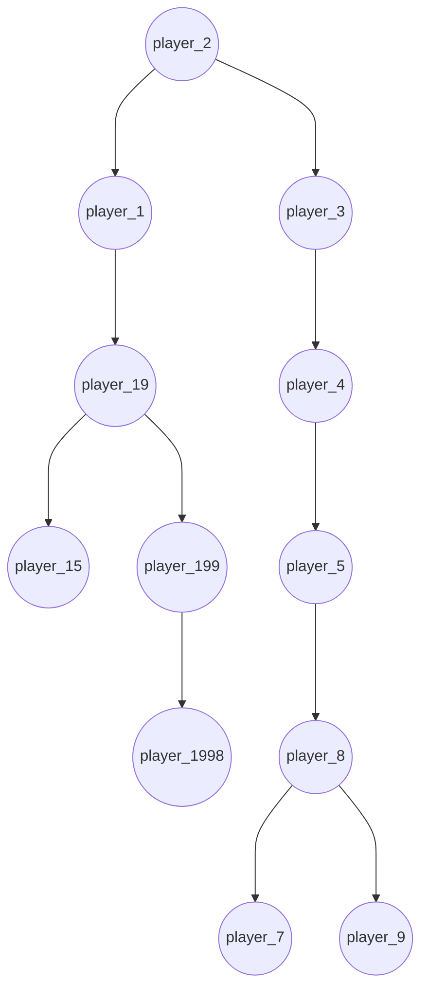

```mermaid

graph 
player_1(("player_1"))
player_15(("player_15"))
player_19(("player_19"))
player_199(("player_199"))
player_1998(("player_1998"))
player_2(("player_2"))
player_3(("player_3"))
player_4(("player_4"))
player_5(("player_5"))
player_7(("player_7"))
player_8(("player_8"))
player_9(("player_9"))
player_2 ---> player_1
player_1 ---> player_19
player_19 ---> player_15
player_19 ---> player_199
player_199 ---> player_1998
player_2 ---> player_3
player_3 ---> player_4
player_4 ---> player_5
player_5 ---> player_8
player_8 ---> player_7
player_8 ---> player_9
```